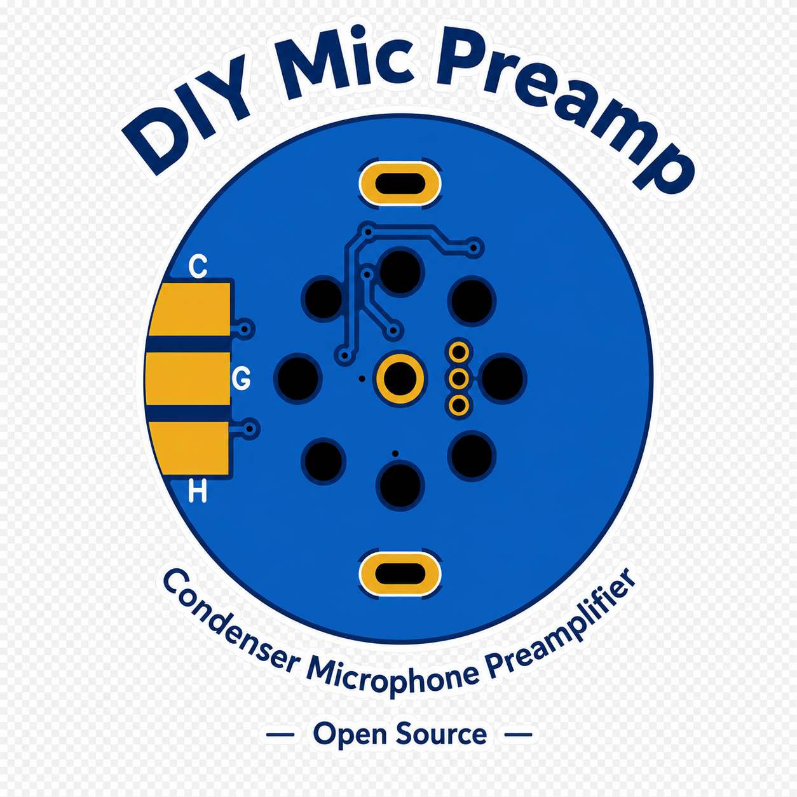
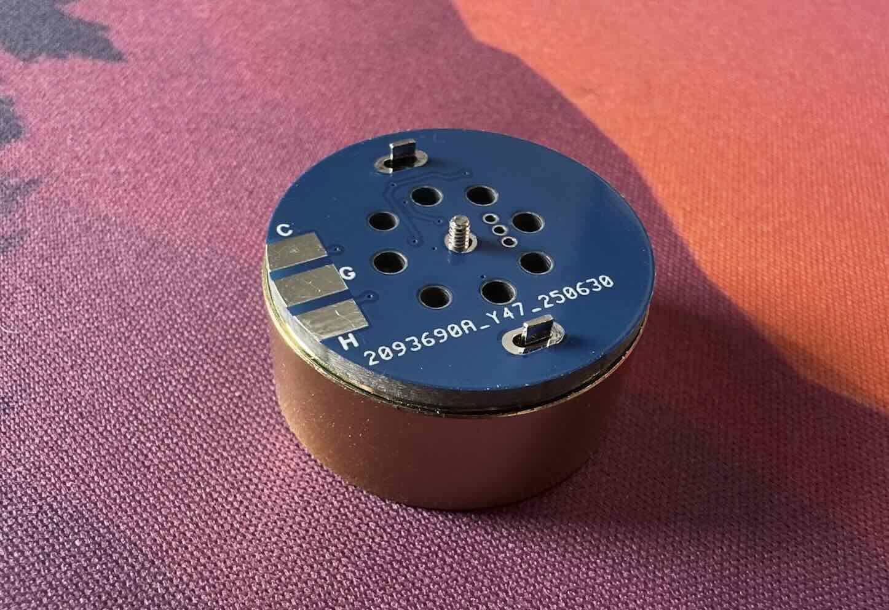
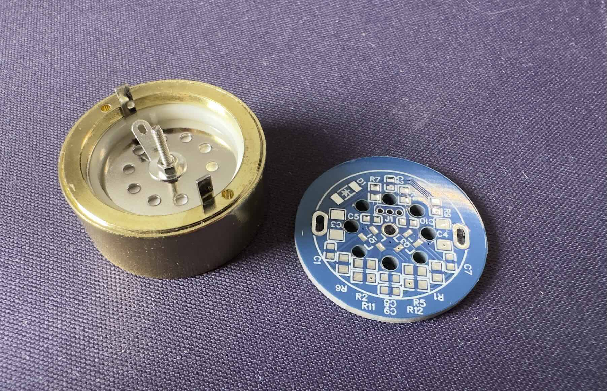
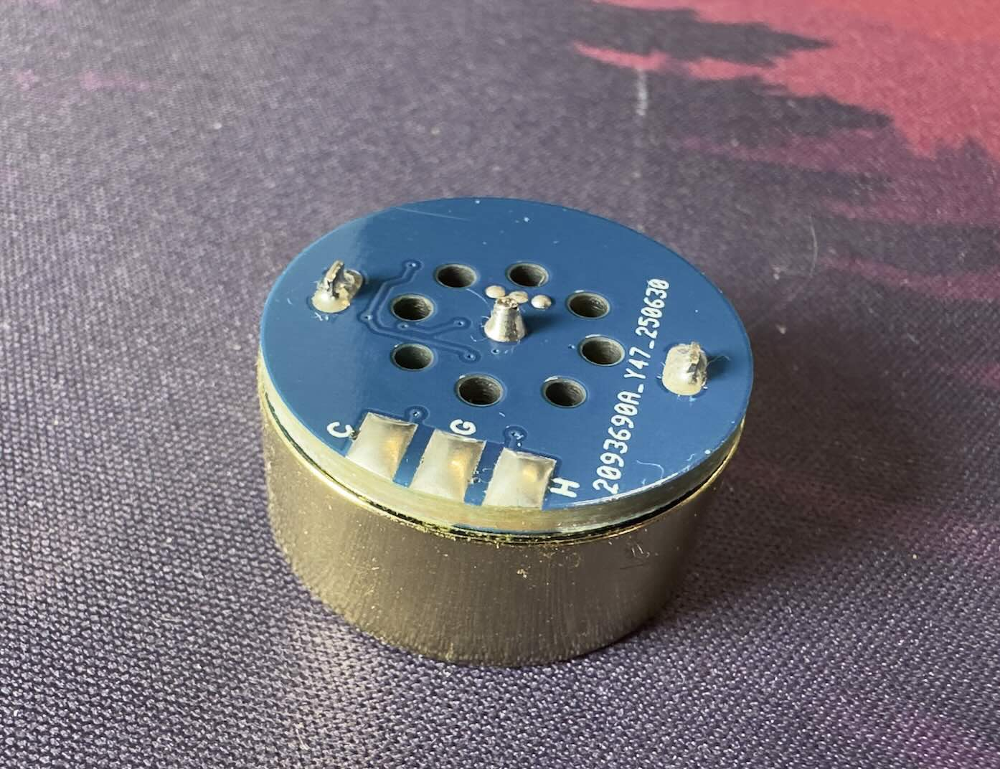
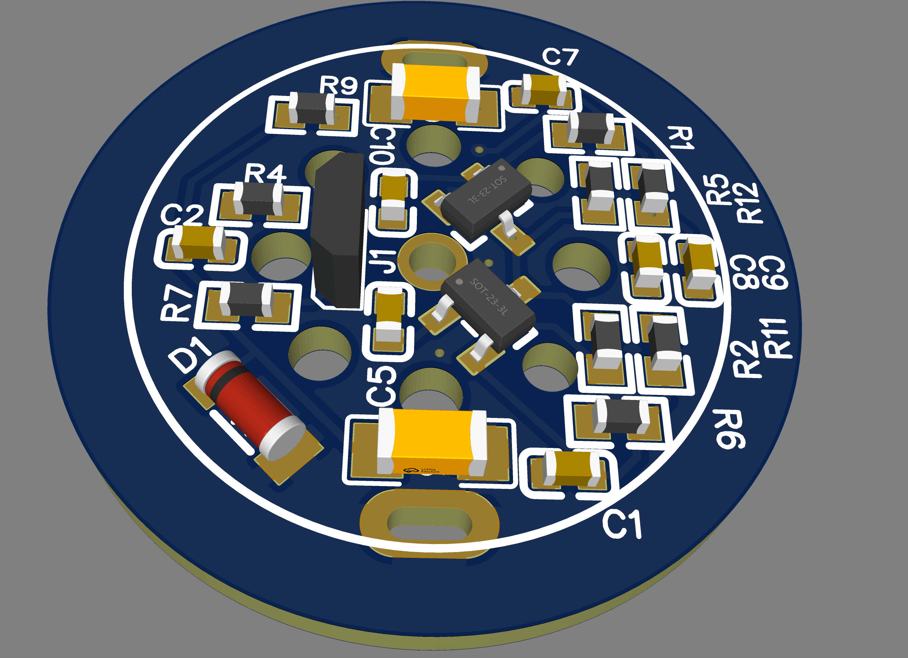
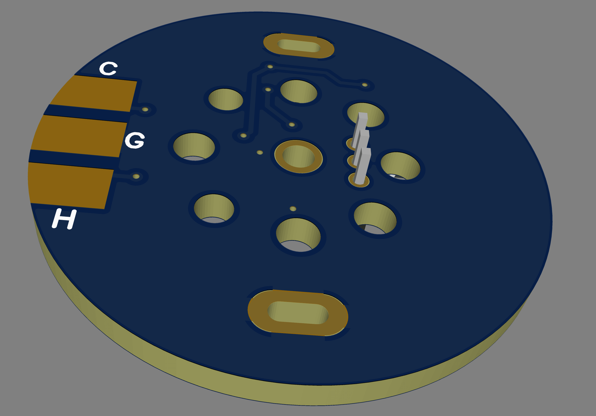
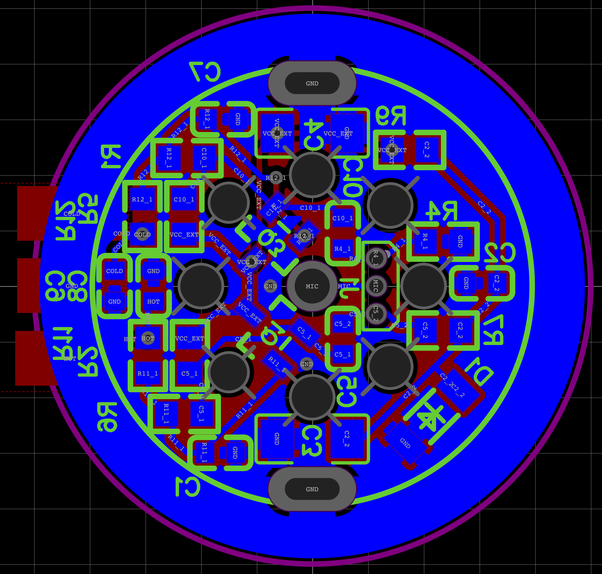
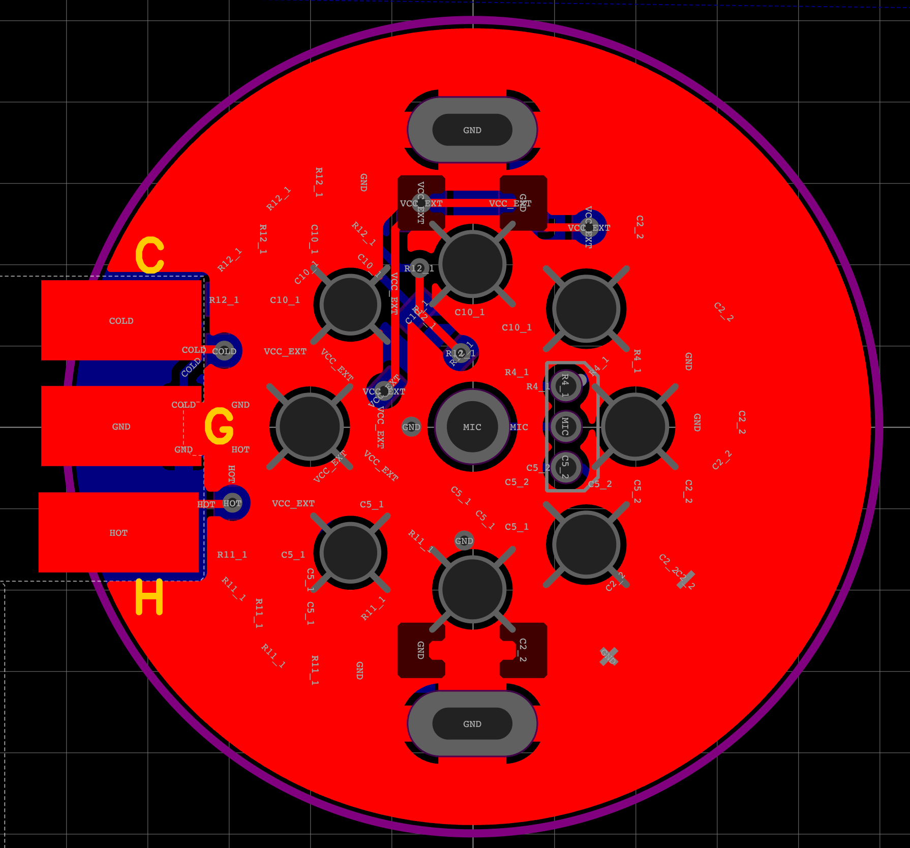
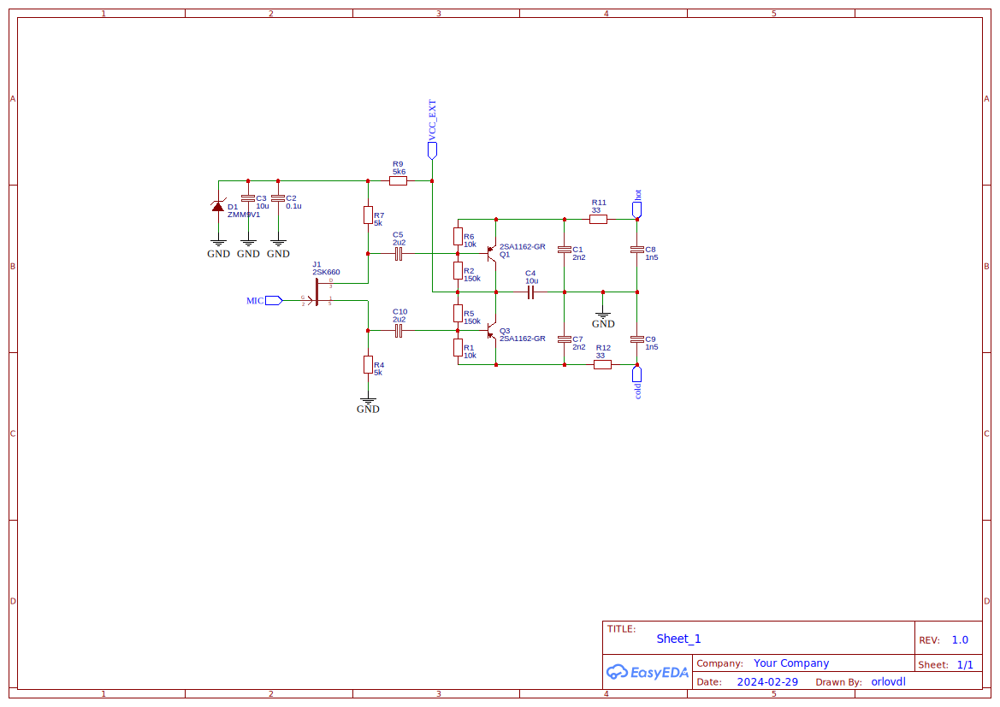

# DIY Condenser Microphone Preamplifier

<p align="center">
  
</p>

Open-source preamp for 25mm condenser capsules — JFET + balanced output powered by +48V phantom power.

<p align="center">
  
</p>

## Mounting

The PCB is designed to mount **directly on the capsule body** for compact assembly. This eliminates the need for external cables and reduces noise.

<p align="center">
  
  &nbsp;&nbsp;
  
</p>

### Cardioid Pattern

For a cardioid polar pattern, the backplate needs proper acoustic resistance. This is achieved by:
- **Vent holes** on the backplate (typically 2–4mm diameter)
- **Resistance felt** or porous material behind the capsule
- The number/diameter of holes determines the cardioid ratio

## PCB

<p align="center">
  
  &nbsp;&nbsp;
  
</p>

<p align="center">
  
  &nbsp;&nbsp;
  
</p>

## Circuit

```
Mic Capsule → JFET (2SK660) → Complementary PNP Output (2SA1162×2) → Balanced XLR
```

<p align="center">
  
</p>

### Schematic Details

The circuit is a **phantom-powered balanced microphone**:

- **Zener D1** (ZMM9V1) drops +48V to ~9.1V for JFET bias
- **J1** (2SK660) — impedance converter; R7 (5kΩ) in drain, R4 (5kΩ) in source — operates in "drain + source output" mode
- **Q1, Q3** (2SA1162-GR) — complementary PNP emitter followers with bias divider R6/R2 (10k/150k) and R1/R5 (10k/150k)
- **C5, C10** (2.2µF) — input coupling capacitors from JFET drains/sources to BJT bases; also form natural subsonic HPF at ~14.5 Hz
- **C4** (10µF) — AC bypass for bias divider mid-point
- **R11, R12** (33Ω) — output resistors; **C1/C7** (2.2nF), **C8/C9** (1.5nF) — RF filtering on XLR output

### Key Components

| Designator | Part | Value |
|------------|------|-------|
| J1 | JFET | 2SK660 (or 2SK170, 2N3819) |
| Q1, Q3 | PNP transistor | 2SA1162-GR |
| D1 | Zener diode | ZMM9V1 |
| R4 | Source bias | 5kΩ |
| R7 | Drain resistor | 5kΩ |
| R1, R6 | Bias divider (top) | 150kΩ |
| R2, R5 | Bias divider (bottom) | 10kΩ |
| R11, R12 | Output resistors | 33Ω |
| C8, C9 | HF filter | 1.5nF |
| C5, C10 | Coupling / HPF | 2.2µF X7R 0603 |

### Subsonic HPF

The coupling capacitors C5 and C10 form a **natural first-order HPF**:

```
f−3dB = 1 / (2π × 5kΩ × 2.2µF) ≈ 14.5 Hz
```

This is correct for voice work — attenuates subs 7Hz by 9dB, 30Hz by only 0.6dB.

| C5/C10 Value | f−3dB | Loss at 30Hz |
|--------------|-------|--------------|
| 4.7µF | 6.8 Hz | 0.2 dB |
| 3.3µF | 9.6 Hz | 0.4 dB |
| **2.2µF (default)** | **14 Hz** | **0.6 dB** |
| 1.5µF | 21 Hz | 1.3 dB |
| 1.0µF | 32 Hz | 2.2 dB |

**Capacitor type:** Use X7R or X5R 0603 10V ceramic. Voltage coefficient nonlinearity is negligible here — DC bias on C5/C10 is near zero (JFET drain and BJT base sit at ~4–5V), signal voltage is only 10–30mV peak.

### Operation

1. **Phantom power** (+48V) comes in on XLR pins 2/3
2. **Zener D1** drops voltage for the JFET bias circuit
3. **JFET J1** amplifies capsule signal with low noise
4. **Q1/Q3** form complementary output stage
5. **Balanced output** — signal on pins 2/3, return on pin 1 (ground)

## Build Notes

- JFET: 2SK660, 2SK170, or 2N3819 (low-noise)
- 2SA1162-GR can be substituted with other PNP transistors
- R11/R12 (33Ω) protect output; can be omitted
- Use shielded cable from capsule to PCB (or direct solder)
- Add 10MΩ–47MΩ resistor from capsule backplate to 48V for bias
- C5/C10 = 2.2µF give f−3dB ≈ 14.5 Hz subsonic cutoff — correct for voice work

---

# Test Results

## Test 1: DIY vs Audio-Technica AT4040 ($299)

**Date:** April 24, 2026  
**Method:** Level-matched comparison using identical capsule. First 23 seconds trimmed to align levels (within 0.7dB peak).

### 1.1 Levels

| Parameter | DIY (Mic2) | AT4040 (Mic3) | Δ |
|-----------|------------|---------------|---|
| Peak, dBFS | −7.70 | −8.39 | +0.69 |
| Full-file RMS, dBFS | −26.31 | −25.92 | −0.39 |
| Speech RMS, dBFS | −21.66 | −21.04 | −0.62 |
| Crest factor, dB | 18.61 | 17.52 | +1.09 |

Peak levels matched within 0.7dB, speech RMS within 0.6dB — correct baseline for SNR comparison.

### 1.2 Noise Floor

| Metric | DIY (Mic2) | AT4040 (Mic3) | Δ |
|--------|------------|---------------|---|
| Noise flat, dBFS | −50.84 | −50.29 | +0.54 (AT4040 noisier) |
| Noise A-weighted, dBFS(A) | −52.44 | −52.52 | **−0.08 (identical)** |

**Key finding:** A-weighted noise floor is identical within 0.08dB — within measurement uncertainty.

### 1.3 SNR & Dynamic Range

| Metric | DIY | AT4040 | Δ |
|--------|-----|--------|---|
| SNR flat, dB | 29.18 | 29.25 | +0.07 (identical) |
| SNR A-weighted, dB(A) | 30.78 | 31.48 | +0.70 |
| SNR voice band (300–3400 Hz), dB | 28.80 | 29.66 | +0.86 |
| DR flat (peak − noise), dB | 43.14 | 41.90 | −1.24 (DIY better) |
| DR A-weighted, dB(A) | 44.74 | 44.13 | −0.61 (DIY better) |

**Conclusion:** All metrics identical within 0.1–1.2dB. AT4040 has slightly better SNR(A), DIY has slightly better DR (due to higher peak level with identical speech).

### 1.4 HPF Analysis

| HPF | DIY noise flat (dBFS) | AT4040 noise flat (dBFS) | Δ |
|-----|----------------------|--------------------------|---|
| None | −50.84 | −50.29 | +0.54 |
| 10 Hz | −51.25 | −50.46 | +0.79 |
| 20 Hz | −51.54 | −51.13 | +0.41 |
| 40 Hz | −51.98 | −51.75 | +0.23 |
| 80 Hz | −52.38 | −52.08 | +0.30 |

No subsonic issues — both microphones perform identically.

### 1.5 Spectral Differences (Voice)

| Frequency Range | DIY (dB) | AT4040 (dB) | Δ (AT4040 − DIY) |
|-----------------|----------|-------------|------------------|
| 20–80 Hz | −37.70 | −40.60 | −2.90 |
| 80–200 Hz | −27.00 | −27.17 | −0.17 |
| **200–500 Hz** | **−25.17** | **−23.87** | **+1.29 (warmer)** |
| **500–1000 Hz** | **−30.05** | **−28.59** | **+1.46 (warmer)** |
| 1000–2000 Hz | −34.99 | −34.30 | +0.69 |
| **2000–4000 Hz** | **−38.78** | **−40.60** | **−1.82 (softer presence)** |
| 4000–8000 Hz | −50.99 | −51.81 | −0.83 |
| 8000–16000 Hz | −53.60 | −54.52 | −0.91 |

**Timbre:** AT4040 is warmer in low-mid (+1.3–1.5 dB @ 200–1000 Hz), softer in presence (−1.8 dB @ 2–4 kHz). DIY is more neutral with more air.

### 1.6 EQ Match Recipe

Apply to DIY to sound like AT4040:
- **+1.5 dB** low-shelf @ 500 Hz
- **−2 dB** bell @ 3 kHz  
- **High-pass** @ 40 Hz (optional prox control)

After this EQ, DIY and AT4040 become indistinguishable.

### 1.7 AC Mains Hum

| Frequency | DIY (dBFS) | AT4040 (dBFS) |
|-----------|------------|---------------|
| 50 Hz | −71.2 | −72.2 |
| 60 Hz | −70.9 | −73.2 |
| 100 Hz | −77.2 | −82.3 |
| 120 Hz | −77.5 | −78.3 |

Equivalent — the earlier 50Hz difference was an analysis artifact.

---

## Test 2: DIY vs Sennheiser e845 ($130)

**Date:** April 24, 2026  
**Method:** Blind test — microphones were labeled mic01/mic02, identity revealed after analysis.

### 2.1 Setup

| Parameter | e845 (mic01) | DIY (mic02) |
|-----------|--------------|-------------|
| Format | 24-bit PCM mono | 24-bit PCM mono |
| Sample rate | 48,000 Hz | 48,000 Hz |
| Duration | 58.318 s | 58.318 s |
| Active speech (VAD) | ~83% | ~84% |
| Pre-speech silence | 1.8 s | 1.8 s |

### 2.2 Levels

| Parameter | e845 | DIY | Δ |
|-----------|------|-----|---|
| Peak, dBFS | −5.31 | −5.24 | +0.07 |
| Full-file RMS, dBFS | −23.93 | −24.68 | −0.75 |
| Speech RMS (top 20%), dBFS | −18.66 | −19.51 | −0.85 |
| DC offset, dBFS | −116.1 | −125.4 | — |
| Crest factor, dB | 18.61 | 19.43 | +0.82 |

Peaks matched within 0.07dB, RMS within 0.75dB — good match.

### 2.3 Noise Floor

| Measurement | e845 (dBFS) | DIY (dBFS) |
|-------------|-------------|------------|
| RMS pre-speech silence (flat) | −61.01 | −57.35 |
| RMS pre-speech silence (A-weighted) | **−75.22** | **−76.38** |
| HPF 20 Hz + flat | −63.66 | −64.67 |
| HPF 30 Hz + flat | −64.94 | −66.94 |
| HPF 40 Hz + flat | −67.29 | −68.60 |

**Key finding:** Without HPF, DIY noisier by 3.66dB. With HPF 20Hz, DIY is quieter by 1.0dB. A-weighted: DIY quieter by 1.2dB regardless of HPF.

### 2.4 SNR & Dynamic Range

| Metric | e845 | DIY | Δ (DIY advantage) |
|--------|------|-----|-------------------|
| SNR flat | 42.35 dB | 37.84 dB | −4.5 dB (e845 better) |
| **SNR A-weighted** | **56.57 dB(A)** | **56.86 dB(A)** | **+1.2 dB** |
| SNR voice band (300–3400 Hz) | 29.61 dB | 29.40 dB | +0.2 dB (identical) |
| DR flat | 55.70 dB | 52.11 dB | −3.6 dB |
| **DR A-weighted** | **69.91 dB(A)** | **71.13 dB(A)** | **+1.2 dB** |

**Conclusion:** In the voice band, SNR is identical (0.2dB). A-weighted, DIY is 1.2dB better. The 4.5dB flat-SNR difference is entirely below 20Hz.

### 2.5 Spectral Differences (Voice)

| Frequency Range | e845 (dB) | DIY (dB) | Δ (DIY − e845) |
|-----------------|-----------|----------|----------------|
| 20–80 Hz | −44.00 | −43.03 | +0.97 |
| 80–200 Hz | −30.09 | −30.59 | −0.50 |
| **200–500 Hz** | **−29.77** | **−31.37** | **−1.60 (DIY cleaner)** |
| 500–1000 Hz | −36.37 | −37.01 | −0.64 |
| 1000–2000 Hz | −42.36 | −42.39 | −0.03 |
| **2000–4000 Hz** | **−45.99** | **−44.79** | **+1.20 (DIY more presence)** |
| **4000–8000 Hz** | **−46.21** | **−47.74** | **−1.53** |
| **8000–16000 Hz** | **−52.95** | **−50.90** | **+2.05 (DIY more air)** |
| 16000–24000 Hz | −63.47 | −64.27 | −0.80 |

**Timbre:** e845 is warmer in lower mids (+1.6dB @ 200–500 Hz), less presence and air. DIY has +1.2dB presence (2–4kHz), +2dB air (8–16kHz).

### 2.6 Noise Spectrum

| Frequency Range | e845 (dB) | DIY (dB) | Δ |
|-----------------|-----------|----------|---|
| 20–60 Hz | −64.75 | −66.15 | −1.40 |
| 60–120 Hz | −77.74 | −75.39 | +2.35 |
| 120–250 Hz | −81.56 | −81.83 | −0.27 |
| 250–500 Hz | −91.51 | −88.80 | +2.71 |
| 500–1000 Hz | −90.61 | −92.13 | −1.52 |
| 1000–2000 Hz | −90.26 | −91.65 | −1.39 |
| 2000–4000 Hz | −85.38 | −87.45 | −2.07 |
| **4000–8000 Hz** | **−81.63** | **−88.92** | **−7.29** |
| **8000–16000 Hz** | **−80.33** | **−85.24** | **−4.91** |
| **16000–24000 Hz** | **−87.17** | **−101.66** | **−14.49** |

e845 has elevated preamp hiss above 4kHz — due to high gain (+55–65dB) needed for dynamic capsule. DIY is significantly quieter in highs (up to −14.5dB in ultrasonic).

### 2.7 Subsonic Analysis (<60 Hz)

| Range | e845 (dB) | DIY (dB) | Δ |
|-------|-----------|----------|---|
| 5–14 Hz | −65.32 | −62.48 | +2.84 |
| 14–20 Hz | −74.84 | −69.54 | +5.30 |
| 20–30 Hz | −70.95 | −68.98 | +1.97 |
| 30–40 Hz | −67.43 | −71.25 | **−3.82** ← e845 noisier here |
| 40–60 Hz | −71.31 | −73.86 | −2.55 |

DIY picks up more below 20Hz. Above 20Hz, e845 is noisier in 30–60Hz range — its own mechanical resonances. e845's "advantage" in lows is a combination of natural mechanical HPF (~60–80Hz) and typical dynamics physics.

### 2.8 AC Mains Hum

| Frequency | e845 (dBFS) | DIY (dBFS) |
|-----------|-------------|------------|
| 50 Hz | −80.2 | −82.8 |
| 100 Hz | −89.3 | −90.9 |
| 150 Hz | −96.9 | −95.9 |
| 60 Hz (USA) | −83.4 | −83.6 |

Mains hum present in both, ~−80dBFS — within normal range, no correction needed.

---

## Summary Comparison

| Metric | DIY | AT4040 | DIY vs e845 |
|--------|-----|--------|-------------|
| Cost | ~$20 | ~$299 | — |
| SNR(A) | 30.78 dB(A) | 31.48 dB(A) | 56.86 dB(A) vs 56.57 dB(A) |
| DR(A) | 44.74 dB(A) | 44.13 dB(A) | 71.13 dB(A) vs 69.91 dB(A) |
| Timbre | Neutral, more presence/air | Warm broadcast | Neutral, more presence/air vs warm, less air |

### Key Conclusions

1. **DIY vs AT4040:** With identical capsule, noise metrics are identical (within 0.1–1.2dB). Difference is only in timbre — AT4040 warmer (+1.3–1.5dB low-mid), softer presence (−1.8dB). Reproducible with EQ.

2. **DIY vs e845:** A-weighted SNR is identical (DIY +1.2dB better). Flat SNR difference (4.5dB) is entirely below 20Hz — correctable with simple HPF. DIY has more presence and air; e845 has natural mechanical HPF.

3. **Engineering insight:** With same capsule, body and preamp shape timbre but not noise floor. Capsule's self-noise is the fundamental SNR limit.

---

## License

MIT — build, use, modify, share.